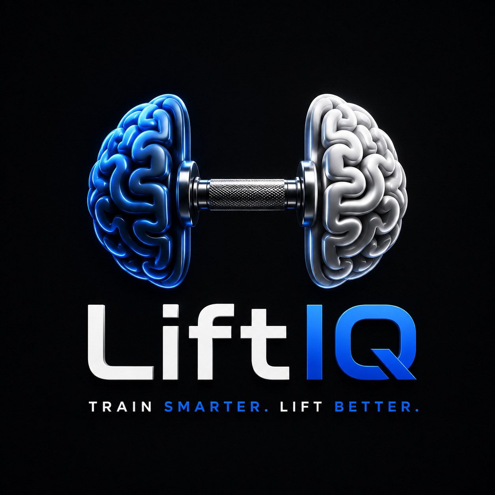

<p align="center">
  
</p>

<h1 align="center">LiftIQ</h1>

<p align="center">
<b>Train Smarter. Lift Better.</b>
</p>

<p align="center">
AI-powered fitness companion built with Kotlin, FastAPI and Supabase.
</p>

---

# Overview

LiftIQ is an AI-powered fitness assistant designed to remove the guesswork from strength training. Instead of manually calculating calories, protein intake, workout progression, and training volume, LiftIQ automatically generates personalized workout plans and nutrition targets using a modern backend architecture.

The application combines native Android development with intelligent backend services to deliver a complete, end-to-end fitness companion — from onboarding to daily training to long-term progression.

---

## ✨ Features

### 🧭 Smart Onboarding
- Personalized user profile
- Body measurements (height, weight, age)
- Goal selection (bulk, cut, maintain)
- Experience level (beginner → advanced)
- Activity level

### 🍎 Nutrition Calculator
Automatically calculates:
- BMR (Basal Metabolic Rate)
- TDEE (Total Daily Energy Expenditure)
- Daily calorie target


### 🏋️ Intelligent Workout Planning
- Personalized weekly workout plans
- Beginner / Intermediate / Advanced support
- Equipment-aware weight generation
- Science-based exercise ratios

### 📈 Progressive Overload
LiftIQ automatically adjusts training intensity based on:
- RPE (Rate of Perceived Exertion) score
- Previous workout performance
- Weight progression over time
- Full performance history

### 📝 Workout Tracking
Track every session in detail:
- Exercises
- Sets & repetitions
- Weight
- RPE

### 🔧 Workout Customization
- Reorder exercises
- Override weights and sets
- Swap exercises for alternatives
- Real-time synchronization with the backend

### 🌙 Recovery Detection
If no workout is scheduled for today, LiftIQ automatically displays a Recovery Day, encouraging rest as part of the training cycle.

---

## 🛠 Tech Stack

**Android**
- Kotlin
- Jetpack Compose
- Material 3
- Retrofit
- Coroutines
- DataStore

**Backend**
- Python
- FastAPI
- PostgreSQL
- Supabase (Auth + Database)

**Infrastructure**
- AWS EC2
- Brevo (transactional email)

---

## 🏗 Architecture

```
Android App (Kotlin / Jetpack Compose)
              │
              ▼
     REST API (FastAPI)
              │
              ▼
   Supabase (Auth + PostgreSQL)
```

---

## ✅ Current Features

- Authentication & email verification
- User onboarding
- Nutrition calculator
- Baseline workout generator
- Progressive overload engine
- Workout history
- Exercise overrides & swaps
- Recovery day detection
- Profile management

## 🔮 Planned Features

- PR tracking
- Workout analytics
- AI workout coach
- Smart recovery suggestions
- Apple Health integration
- Google Fit integration
- Wear OS support
- Push notifications
- Dark theme improvements

---

## 📄 Legal

- [Privacy Policy](./PRIVACY_POLICY.md)
- [Terms & Conditions](./TERMS_AND_CONDITIONS.md)
- [License](./LICENSE) — this project is proprietary software.

---

## 👤 Author

**Ramazan Yüksel**
Computer Engineering Student · Backend Developer · Android Developer

[GitHub](https://github.com/Ramazan-Yuksel)